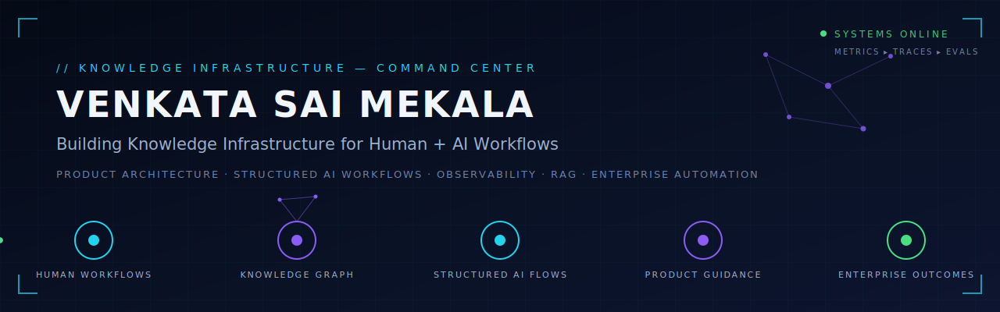

<div align="center">



<br>

*I design **structured AI systems** — built from real product understanding and customer requirements, with observability, metrics, and traceability engineered in from day one.*

</div>

<br>

## ▍ HOW I BUILD

```
PRODUCT UNDERSTANDING → CUSTOMER REQUIREMENTS → STRUCTURED SYSTEM DESIGN → OBSERVABLE AI EXECUTION
```

I work at the intersection of **Product Architecture, Agentic AI, Digital Adoption, RAG systems, Enterprise Automation, and Data Intelligence**. My focus: designing systems that understand how software, workflows, and organizations actually operate — then turning that knowledge into guidance, automation, analytics, and AI execution layers.

I don't build black-box autonomous agents. Every AI system I design runs in a **structured flow** — defined stages, measurable outputs, full traceability. Production AI should be as auditable as any other enterprise system.

<br>

## ▍ WHAT I BUILD

**Knowledge Infrastructure** — systems that capture product behavior, workflow context, documentation, user journeys, and operational knowledge, then make it usable by humans and AI agents.

**Structured Agentic Systems** — orchestrated multi-agent workflows, autonomous QA agents, crawler-based learning systems, and AI execution pipelines — with observability, metrics, and evals built into every stage.

**Digital Adoption Platforms** — guidance engines, walkthroughs, checklists, onboarding flows, drift detection, and product-learning layers for enterprise software.

**Data & Decision Intelligence** — dashboards, KPI systems, analytics workflows, SQL/Python pipelines, and BI solutions for decision-making.

<br>

## ▍ SIGNATURE PROJECTS

| System | Function | Status |
|---|---|---|
| **GuideNow Intelligence Layer** | Digital Adoption and product-learning system — understands software flows, guides users in-app, and feeds contextual product knowledge to AI agents | Private |
| **[Synapse_OS](https://github.com/venkata2894/Synapse_OS)** | Multi-agent operations platform — coordinates AI agents, task workflows, memory, handovers, evaluations, and project execution | Public |
| **Scout Agent** | Autonomous QA agent — tests guide installation, rendering, user navigation, and digital adoption behavior across web applications | Private |
| **[WPI Inflation KPI Command Center](https://github.com/venkata2894/wpi-inflation-kpi-command-center)** | Data intelligence over open economic data — inflation trends, drivers, and KPI-level insights | Public |

<sub>More public work: [knowledge-graph-llms](https://github.com/venkata2894/knowledge-graph-llms) · [AI_Security_Research](https://github.com/venkata2894/AI_Security_Research) · [Universal-Text-Translator-Steganography-Toolkit](https://github.com/venkata2894/Universal-Text-Translator-Steganography-Toolkit)</sub>

<br>

## ▍ CORE STACK

| Capability | Tools |
|---|---|
| **AI & Agents** | LLMs · RAG · GraphRAG · LangChain · Agentic Workflows · Prompt Engineering · Vector Search · LLM Evals |
| **Engineering** | Python · FastAPI · Flask · Next.js · Playwright · SQL · DuckDB · Streamlit |
| **Knowledge & Data** | Neo4j · FAISS · Power BI · Bold BI · Ontologies · Semantic Modeling · Workflow Mapping |
| **Product & Strategy** | Product Architecture · Requirement Analysis · Solution Design · Stakeholder Management · Enterprise Automation |

<br>

## ▍ CURRENT FOCUS

Exploring how organizations can build a **living representation of their workflows, software behavior, and operational knowledge** — so humans can adapt faster and AI agents can execute more safely, with every action observable and traceable.

<br>

## ▍ PHILOSOPHY

> The future of enterprise AI is not only about smarter models.
> It is about building structured knowledge layers that help humans and agents understand how work actually happens.

<br>

## ▍ CONNECT

[](https://www.linkedin.com/in/venkata-sai-mekala-96209a16a/)
[](#)

<sub>Open to conversations about structured AI systems, knowledge infrastructure, and enterprise automation.</sub>
